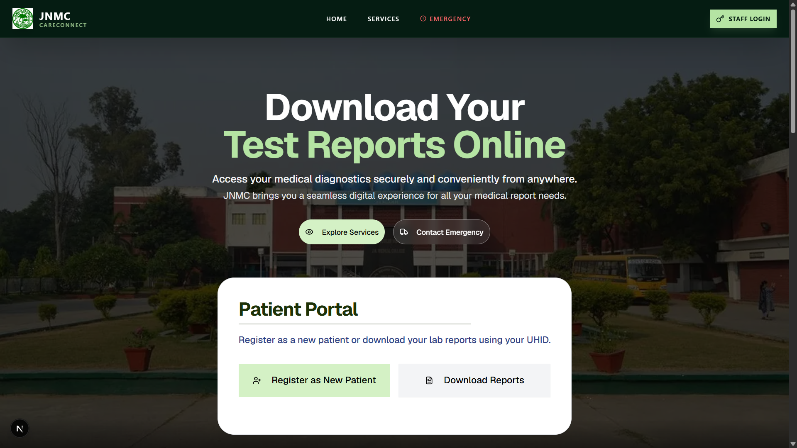

# 🏥 JNMC CareConnect

JNMC CareConnect Backend is an enterprise-grade Laboratory Information System (LIS) and healthcare management engine built with Node.js, Express, and MongoDB. The platform facilitates role-based workflows for clinical administrators, department sub-admins, doctors, lab processors, and patients, complete with integrated  OCR processing, automated PDF rendering, secure payment processing, and Turnaround Time (TAT) optimization pipelines.

---


## Screenshots




# 🚀 Core Features

## 🔒 Authentication & Security

### Multi-Role Identity Access Control
Dedicated registration and authentication workflows for:
- System Administrators
- Departmental Sub-Administrators
- Doctors
- Laboratory Employees
- Patients

### JWT-Based Authorization
Secure session validation using JSON Web Tokens (JWT) processed through authorization headers.

### Token Lifecycle Management
- Database-backed JWT (`jti`) tracking
- Token whitelisting and blacklisting
- Immediate session revocation on logout

### Password Security
- Salted password hashing
- bcrypt / bcryptjs implementation
- Secure credential storage

### Role-Based Route Protection
Custom middleware enforcing granular access control and endpoint-level authorization.

---

## 🧪 Laboratory & Booking Management

### Multi-Category Patient Registration
Supports dynamic workflows for:
- General Public
- Students
- Institutional Staff

Including custom fee structures and booking rules.

### Automated Identifier Generation
Atomic sequential counters generate:
- Unique Health IDs (UHID)
- Laboratory Invoice IDs

Ensuring consistency and data integrity.

### Aadhaar Verification Integration
Identity validation workflows to verify patient information before clinical processing.

---

## 📊 Turnaround Time (TAT) Analytics

### End-to-End Sample Tracking
Complete lifecycle monitoring across:
1. Sample Collection
2. Courier Transit
3. Laboratory Processing
4. Pathologist Verification
5. Report Generation

### Operational Bottleneck Analysis
Real-time performance metrics provide:
- Average processing times
- SLA compliance monitoring
- Workflow optimization insights

---

## 📄 Document Automation & OCR

### Dynamic PDF Report Generation
Professional laboratory reports generated through:
- HTML Templates
- Puppeteer
- PDFKit

### OCR-Based Data Extraction
Powered by Tesseract OCR for:
- Laboratory Forms
- Labels
- Printed Reports
- Clinical Documents

---

## 🤖 AI-Powered Clinical Insights

### Google Gemini Integration
Native integration with:

`@google/genai`

Using:

`gemini-2.5-flash`

for clinical data processing.

### Automated Diagnostic Summaries
Transforms complex laboratory data into:
- Patient-friendly explanations
- Structured clinical summaries
- Doctor-ready interpretations

---

## 💳 Payment Gateway Integration

### Razorpay Checkout
Secure order creation and payment processing via server-side APIs.

### Payment Verification
HMAC SHA-256 signature validation ensures:
- Transaction authenticity
- Protection against payment tampering
- Secure checkout workflows

---

## ☁️ Cloud Storage Infrastructure

### Cloudflare R2 Storage
S3-compatible object storage for:
- Laboratory Reports
- PDFs
- Medical Documents

### Presigned URL Access
Secure temporary asset access with:
- Time-limited URLs
- Default 5-minute expiration
- Protected patient data delivery

### Cloudinary Integration
CDN-backed storage and optimization for:
- Profile Images
- Application Assets
- Static Media

---

## 🛠️ System Administration & Auditing

### Activity Audit Logs
Comprehensive event tracking for:
- Create Operations
- Update Actions
- Administrative Overrides
- Compliance Monitoring

### Dynamic Configuration Management
Centralized controls for:
- Environment Settings
- Operational Thresholds
- Runtime Configuration

### Real-Time System Monitoring
Public health-check endpoints providing:
- Server Status
- Uptime Metrics
- Performance Statistics
- Cluster Health Information

---


## 🚀 Installation & Setup

### Backend Setup

```bash
cd backend_jnmc_careconnect
```
```
npm install
```
```
npm run dev
```


### Frontend Setup

```bash
cd frontend_jnmc_careconnect
```
```
npm install
```
```
npm run dev
```

Website runs on:  
`http://localhost:5173`
